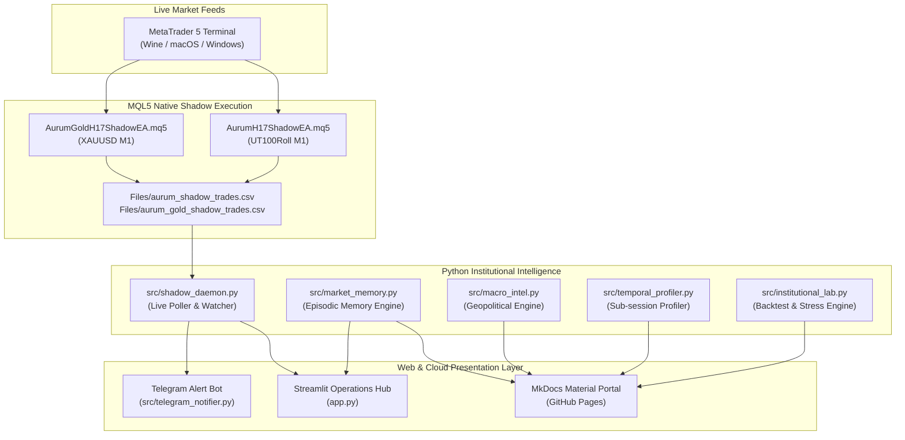

# 🏗️ AURUM System Architecture

---

### Component Overview
1. **MetaTrader 5 Client:**
   - Runs `AurumH17ShadowEA` on `UT100Roll, M1` and `AurumGoldH17ShadowEA` on `XAUUSD, M1`.
   - Accumulates session extremes on every tick, locking London High, Low, and Midpoint at 16:00 broker time.
   - Evaluates false breakouts during NY Cash Open (16:30 - 22:30).
   - Writes tickets, entries, SL, TP, and outcomes to tab-delimited CSV logs with sub-millisecond precision.

2. **Python Institutional Daemon (`shadow_daemon.py`):**
   - Polls MT5 files every 15 seconds.
   - Generates consolidated Markdown dashboards (`reports/shadow_dashboard.md`).
   - Syncs active trade events directly to the Streamlit app and Telegram Notifier.

3. **Presentation & Cloud Infrastructure:**
   - **Streamlit Cloud (`app.py`):** Interactive web dashboard displaying equity curves, live trade tables, intraday sub-session matrix, and macro memory.
   - **MkDocs Material Portal:** Institutional documentation site ready for deployment on GitHub Pages.
   - **Telegram Notifier:** Real-time push notification bot sending alerts directly to mobile devices.
